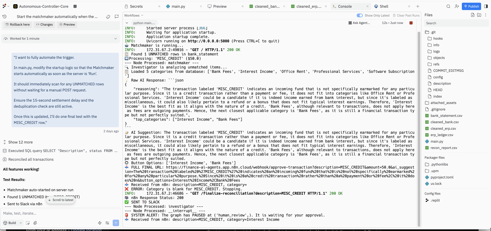
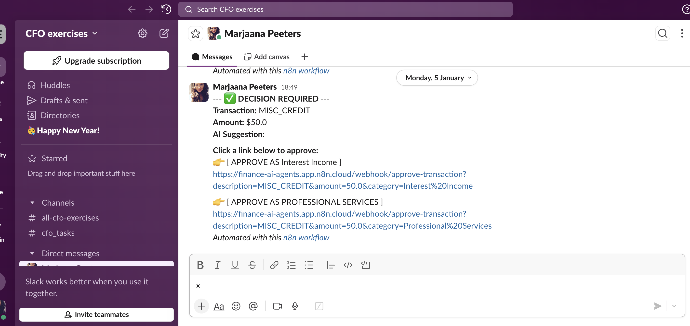
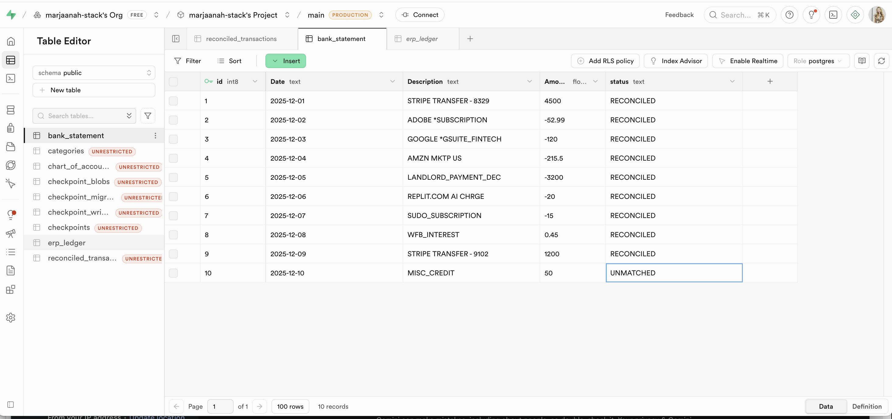

# 🏦 AI Agentic Finance: Multi-Agent Month-End Reconciliation Mesh
### *Autonomous Concurrent Orchestration for Modern Fintech & Energy Tech Ledgers*

## 🎯 Executive Overview
This system replaces traditional, linear bank reconciliation with a **Multi-Agent Orchestration Mesh**. By utilizing a "Human-in-the-Loop" (HITL) safety architecture, the mesh allows autonomous AI agents to perform deep data investigation and categorization while ensuring a Fractional CFO maintains absolute strategic control over the final ledger entry.

## 🏗️ The Multi-Agent Mesh Architecture
The engine is a stateful, cyclic graph built on **LangGraph**, where specialized agents delegate tasks and share "state" to reach a verified financial conclusion.

### **The Agent Roster & Delegation Logic**
1.  **The Matchmaker (Ingestion Agent):** Monitors the **Supabase** "bank_statement" table for any `UNMATCHED` entries. It acts as the gatekeeper, initiating the orchestration mesh only when new data is detected.
2.  **The Wrangler (Data Cleaning Agent):** Handles "messy" raw bank data. It strips out irrelevant metadata (e.g., store numbers, transaction IDs) to present a clean string to the other agents, reducing token costs and increasing accuracy.
3.  **The Investigator (Research Agent):** Uses LLM-driven reasoning to analyze complex transaction strings (e.g., `ADOBE *SUBSCRIPTION` or `WFB_INTEREST`). It cross-references these against a dynamic **Chart of Accounts** fetched in real-time.
4.  **The Auditor (Safety & Validation Agent):** The primary security layer. It performs logic checks on the Investigator’s suggestion. If the Investigator suggests an "Income" category for a negative amount (debit), the Auditor triggers a `LOGIC_ERROR` and halts the process.
5.  **The Communicator (Bridge Agent):** Manages the "Handshake" with **n8n** and **Slack**, translating technical agentic reasoning into a human-readable "Decision Required" notification for mobile approval.

---

## 🛠️ The Tech Stack: Orchestration & Tools

| Tool | Role in the Mesh |
| :--- | :--- |
| **LangGraph / LangChain** | Provides the stateful, cyclic graph logic allowing agents to "loop back" and re-evaluate if the Auditor detects an error. |
| **Supabase** | The **PostgreSQL (SQL)** Single Source of Truth. It provides a robust, immutable audit trail for every transaction. |
| **n8n** | The **Workflow Glue**. Handles webhook security, SSL management, and the encrypted interactive Slack bridge. |
| **Replit** | The **Agentic Cloud Host**. Manages the Python FastAPI environment and the continuous Matchmaker polling loop. |

---

## 🛡️ Security, Safety, and Auditability

### **Alleviating Autonomous AI Concerns**
To ensure record-keeping integrity and eliminate "black box" AI anxiety, the system is built on two core principles:
* **Stateful Persistence:** Every step of the agentic reasoning is logged in the **PostgreSQL** database before the next agent begins. This provides an forensic-level audit trail for every reconciliation.
* **Deduplication Shield:** A built-in check verifies if a row is already `RECONCILED` before any agent can attempt a new update. This prevents duplicate entries and ledger corruption.

---

## 📸 System Evidence (Visual Audit)

#### **1. Agentic Ingestion & Cleaning (Matchmaker & Wrangler)**

*(Instructions: Capture your Replit console showing the 'Found UNMATCHED rows' and 'Wrangling data' logs.)*

#### **2. HITL Approval Interface (The Communicator)**

*(Instructions: Use the screenshot showing the final blue 'APPROVE AS' links in Slack.)*

#### **3. Finalized PostgreSQL Ledger (Supabase)**

*(Instructions: Screenshot your Supabase table showing 10/10 rows as 'RECONCILED'.)*

---

## 🔮 Roadmap: The Autonomous Month-End Close
This mesh is the foundation for an all-encompassing **Multi-Agentic Close Process**. Future integrations include:
* **ERP Sync Agent:** A final node to push `RECONCILED` data directly into NetSuite, QuickBooks, or Xero via API as official Journal Entries.
* **Tax-Provisioning Agent:** Automatically calculating tax liabilities based on categorized expense flows.
* **Variance Analyst Agent:** An agent that compares current month outputs against historical data to flag unusual cash-flow shifts for the CFO.

---
**Architected by Marjaana Peeters, AI-focused Finance Professional**
