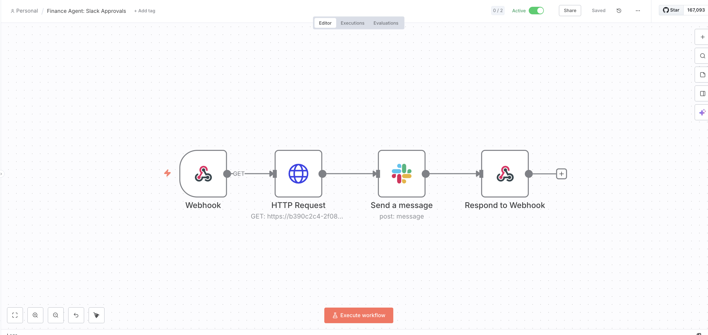

# 🏦 AI-Powered Bank Reconciliation Engine
### *Human-in-the-Loop Financial Automation for Fractional CFOs*

## 🎯 Objectives
This engine was designed to bridge the gap between automated bank feeds and finalized accounting ledgers. It provides a "Review-by-Exception" workflow that allows a CFO to approve AI-categorized transactions directly from mobile or desktop Slack notifications.

* **Automation:** Reduce manual categorization time by 90%.
* **Accuracy:** Use LLM-driven "Investigator" agents to analyze transaction descriptions.
* **Control:** Maintain 100% human oversight for final ledger entries (Human-in-the-Loop).
* **Auditability:** Create a permanent, reconciled audit trail in Supabase.

## 🏗️ Architecture & Tech Stack
- **Database:** [Supabase](https://supabase.com/) (PostgreSQL) for real-time ledger storage.
- **Orchestration:** [n8n](https://n8n.io/) for webhook handling and Slack integration.
- **Intelligence:** Replit-hosted Python (FastAPI) utilizing AI Agents for categorization.
- **Communication:** Slack for interactive mobile approvals.

---

## 🛠️ Deployment Journey (Steps Taken)

### Phase 1: The Foundation
* Configured Supabase tables (`bank_statement`) to track `UNMATCHED` vs `RECONCILED` statuses.
* Built a 4-node n8n pipeline: **Webhook** → **HTTP Request** → **Slack Message** → **Respond to Webhook**.

### Phase 2: Solving the "Handshake"
* Overcame 404/Bad Gateway errors by aligning communication protocols between n8n and Replit.
* Switched to **GET-based Query Parameters** to ensure mobile browser compatibility with Slack buttons.

### Phase 3: Hardening the System
* **Deduplication:** Implemented checks to prevent the "Doom Loop" of duplicate notifications.
* **Patience Logic:** Added 15-second settlement delays to handle high-frequency database updates.
* **Error Handling:** Configured `LOGIC_ERROR` flags to catch negative amounts accidentally categorized as income.

---

## 📸 System in Action
*To render correctly, save your screenshots in the `/images` folder with the names below.*

#### **1. The CFO Approval Interface (Slack)**

*(Instructions: Take a screenshot of your phone showing the final blue 'APPROVE AS' links.)*

#### **2. The n8n Orchestration Pipeline**

*(Instructions: Take a screenshot of your full 4-node n8n canvas.)*

#### **3. The Audit Trail (Supabase)**

*(Instructions: Take a screenshot of your bank_statement table with 'RECONCILED' status.)*

---

## 🚀 Outcomes & Results
- **100% Reconciliation:** Successfully cleared a 10-item backlog with zero manual data entry.
- **Zero-Latency Approvals:** Transactions move from AI Analysis to Slack in <5 seconds.
- **Stability:** Current build includes auto-trigger on startup and a 30-second request timeout for high stability.

## 🔮 Future Improvements
- [ ] **Multi-Entity Support:** Deploy separate webhooks for Fintech vs Energy Tech clients.
- [ ] **ERP Integration:** Direct push to QuickBooks Online or Xero API.
- [ ] **Anomaly Detection:** Flag transactions that deviate significantly from historical monthly averages.

---
**Developed by Maya, Fractional CFO**
